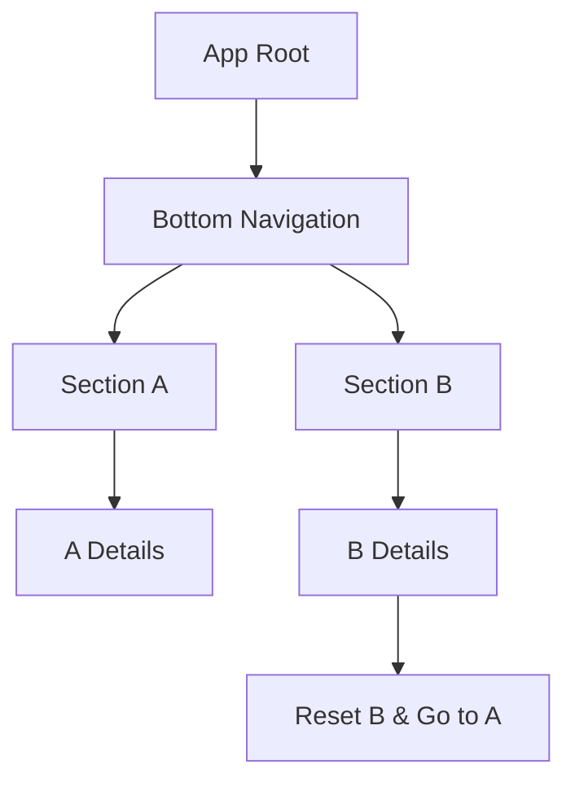
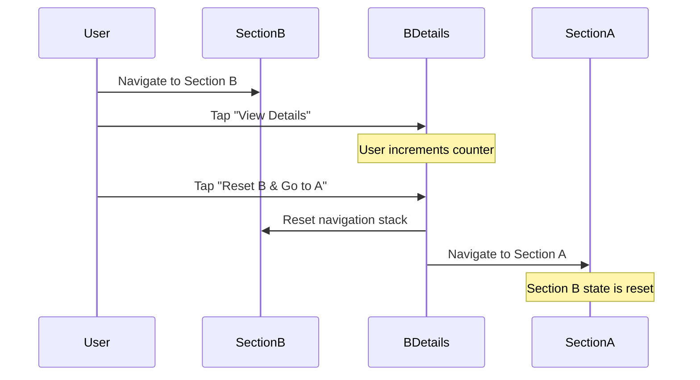

# Flutter Nested Navigation Examples

A comprehensive comparison of Flutter navigation packages for complex nested navigation scenarios. This project extends Andrea Bizzotto's original work by adding more packages and demonstrating complex use cases including bottom navigation, nested routes, and cross-tab navigation patterns.

## 🎯 Project Goals

- **Compare** three major Flutter navigation packages: GoRouter, Beamer, and AutoRoute
- **Demonstrate** complex navigation patterns including nested routes and cross-tab navigation
- **Showcase** real-world scenarios where navigation state management becomes challenging
- **Highlight** the strengths and limitations of each approach

## 📦 Packages & Versions

| Package | Version | Purpose |
|---------|---------|---------|
| [go_router](https://pub.dev/packages/go_router) | 16.2.1 | Declarative routing with nested navigation |
| [beamer](https://pub.dev/packages/beamer) | 1.7.0 | Location-based routing with nested beaming |
| [auto_route](https://pub.dev/packages/auto_route) | 10.1.2 | Code generation based routing |
| [auto_route_generator](https://pub.dev/packages/auto_route_generator) | 10.2.4 | Code generator for AutoRoute |

## 🏗️ Architecture Overview

Each implementation demonstrates the same navigation structure:



## 🔄 Complex Navigation Flow

The key challenge demonstrated is the **cross-tab navigation with state reset**:



## 📝 Real-World Use Case: Form Submission

**Scenario**: Section B Details is a form. The navigation behavior differs based on user action:

### Normal Tab Switching (State Preserved)
- User fills form in B Details → switches to A → returns to B Details
- **Form data persists** (IndexedStack preserves state)

### Form Submission (State Reset)
After successful form submission:
1. **Clear form data** 
2. **Reset Section B** to prevent back navigation to completed form
3. **Navigate to Section A** for fresh user session

Common in e-commerce, surveys, and multi-step workflows where you need clean state after form completion.

## 📊 Implementation Comparison

| Feature | GoRouter | Beamer | AutoRoute |
|---------|----------|---------|-----------|
| **Cross-tab Navigation** | ⚠️ Flash screen issue  | ✅  | ✅  |


### Known Issues

- **GoRouter**: Flash screen occurs during cross-tab navigation with state reset. Workaround: wrap navigation calls in `WidgetsBinding.instance.addPostFrameCallback()`


## 🚀 Getting Started

### Prerequisites
- Flutter SDK >=3.0.0
- Dart SDK >=3.0.0

### Installation

1. Clone the repository:

2. Install dependencies:
```bash
flutter pub get
```

3. Generate AutoRoute files:
```bash
dart run build_runner build
```

### Running the Examples

Each implementation can be run independently:

```bash
# GoRouter implementation
flutter run lib/gorouter/main_gorouter.dart

# Beamer implementation  
flutter run lib/beamer/main_beamer.dart

# AutoRoute implementation
flutter run lib/autoroute/main_autoroute.dart
```

## 🧪 Testing the Complex Navigation

To test the challenging cross-tab navigation scenario:

1. **Navigate to Section B** using bottom navigation
2. **Tap "View Details"** to go to B Details screen
3. **Increment the counter** several times to create state
4. **Tap "Reset B & Go to A"** button
5. **Verify** that:
   - You're now on Section A
   - Section B's navigation stack is reset
   - When you return to Section B, the counter is back to 0
